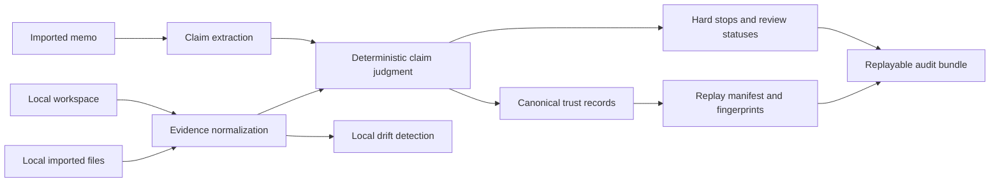

# Agent Atlas

> Agent Atlas is an evidence-auditing research engine that extracts claims from a memo, traces them to sources, flags contradictions and unsupported assertions, and exports replayable trust records.

Agent Atlas is a local, deterministic audit layer for an imported memo and a folder of evidence. It does not browse the web, call an LLM, make an investment recommendation, or replace investors, investment bankers, analysts, or VCs.

## What is in this release

The public surface is the tested imported-memo audit workflow:

- Claim extraction and claim-level evidence judgment in [`external_memo.py`](atlas_engine/external_memo.py) and [`judgment.py`](atlas_engine/judgment.py).
- Hard-stop statuses for imported-database and regulator contradictions, plus unsupported-claim review states.
- Canonical trust records and deterministic replay fingerprints in [`canonical_trust.py`](atlas_engine/canonical_trust.py).
- Replayable audit bundles in [`audit_bundle.py`](atlas_engine/audit_bundle.py).
- Local drift detection through the workspace entity registry in [`entity_registry.py`](atlas_engine/entity_registry.py).
- A file-backed, synthetic five-case benchmark in [`trustbench_cases.json`](atlas_engine/trustbench_cases.json), executed by [`trustbench.py`](atlas_engine/trustbench.py).

The supported input formats are local Markdown, text, CSV, PDF, DOCX, PPTX, and XLSX files. All committed fixtures are synthetic.

## Architecture



## Quick start

Requires Python 3.10 or newer. The audited core has no required third-party runtime dependencies.

```bash
git clone https://github.com/Heman10x-NGU/agent-atlas-trust-audit.git
cd agent-atlas-trust-audit
python -m venv .venv
source .venv/bin/activate
python -m pip install -e .
python -m unittest discover -v
```

Run the synthetic example below. It writes its local index and bundle to ignored paths.

```bash
python - <<'PY'
from pathlib import Path
from atlas_engine.external_memo import audit_external_memo
from atlas_engine.workspace import index_workspace

workspace = Path("examples/workspace")
index_workspace(workspace)

result = audit_external_memo(
    "examples/memo.md",
    workspace,
    import_paths=["examples/imports"],
    export_bundle="audit_bundles/example",
    run_id="readme_example",
)
print(result["verdict"])
print(result["replay_manifest"]["replay_fingerprint"])
PY
```

## Trust statuses

An audit may return `verified`, `supported`, `weak_support`, `unsupported`, `needs_manual_check`, or contradiction statuses. `contradicted_by_imported_database` and `contradicted_by_regulator` are hard stops. A status is an evidence-coverage result from the local inputs, not a finding of objective truth.

## TrustBench

Run the committed fixture benchmark without private data, network access, or paid API keys:

```bash
python - <<'PY'
from atlas_engine.trustbench import run_trustbench

report = run_trustbench(output_path="trustbench-report.json")
print(report["passed"])
print(report["metrics"])
PY
```

The five synthetic cases exercise clean support, imported-data contradiction, regulator contradiction, unsupported assertions, and import drift. The thresholds and metric implementation are committed in [`trustbench.py`](atlas_engine/trustbench.py); do not generalize fixture results to real-world accuracy.

## Optional local evidence configuration

No API key or provider SDK is required. Pass one or more local paths through `import_paths` to audit CSV, XLSX, PDF, Markdown, or text exports. File names can supply a provenance label for familiar database or registry exports; Atlas does not authenticate the provider, fetch new information, or contact any external service.

If you use regulator-labelled evidence, pass the corresponding local labels with `regulators`. This affects the judgement status and report only; it does not create an external connection.

## Privacy and bundles

The audit report and replay bundle intentionally retain source paths, source excerpts, claim text, and fingerprints so a result can be reviewed. Treat them as sensitive local artifacts. `.gitignore` excludes workspaces, imports, local indexes, generated bundles, checkpoints, caches, virtual environments, and environment files. Do not commit or upload a bundle containing confidential material.

## Limitations

- Claim extraction and contradiction detection are deterministic heuristics. They can miss context, ambiguity, negation, and relationships not expressed in the supplied evidence.
- Atlas does not verify that an imported file is authentic, complete, current, or authoritative.
- A matching fingerprint proves stable processing of the recorded inputs, not that the underlying sources remain correct.
- The committed benchmark is synthetic and small. It establishes regression coverage for these cases, not comparative performance or real-world accuracy.
- The local workbench and the old generic research path are intentionally not part of this public release because they are outside the tested public audit scope.

## Development checks

```bash
python -m unittest discover -v
python -m compileall -q atlas_engine tests
git ls-files | sort
```

## Release scope

This repository is a clean release cut from the canonical Phase 3 trust-layer implementation. Historical strategy documents, private workspace data, build logs, cached outputs, provider credentials, and earlier generic-research branches are deliberately excluded.
